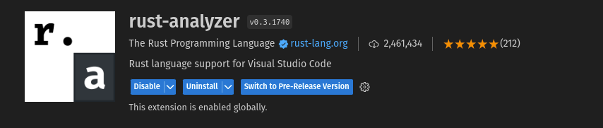
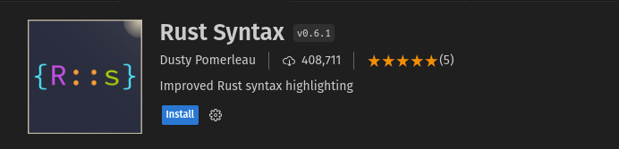
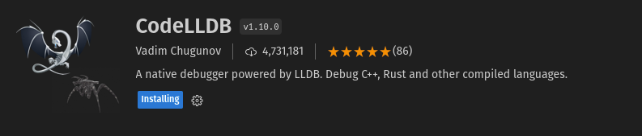

If you haven't set up editor yet, then i suggest you to download Visual studio Code(VSCode). Download it from their website  https://code.visualstudio.com/ 
Once downloaded here is how you set it up for Rust.

### Setting up Editor for Vscode

* **Install  Rust Analyzer Extension** 

  

  * Open VSCode.
  * Go to the Extensions view by clicking on the Extensions icon in the sidebar or pressing `Ctrl+Shift+X`.
  * Search for "***rust-analyzer***" in the Extensions Marketplace.
  * Install the extension

  Rust analyzer has features like code completion, goto definition, finding references , inlay hinting that makes your editor a Rust Development Environment

* Other extensions you can install
  * **Rust Syntax** : Better Rust syntax highlighting

  

  * **Crates** : Makes Managing dependencies easier

  

  * **CodeLLDB** : To debug Rust code

  